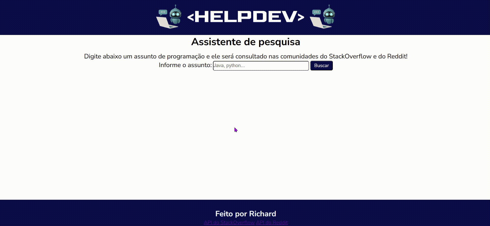
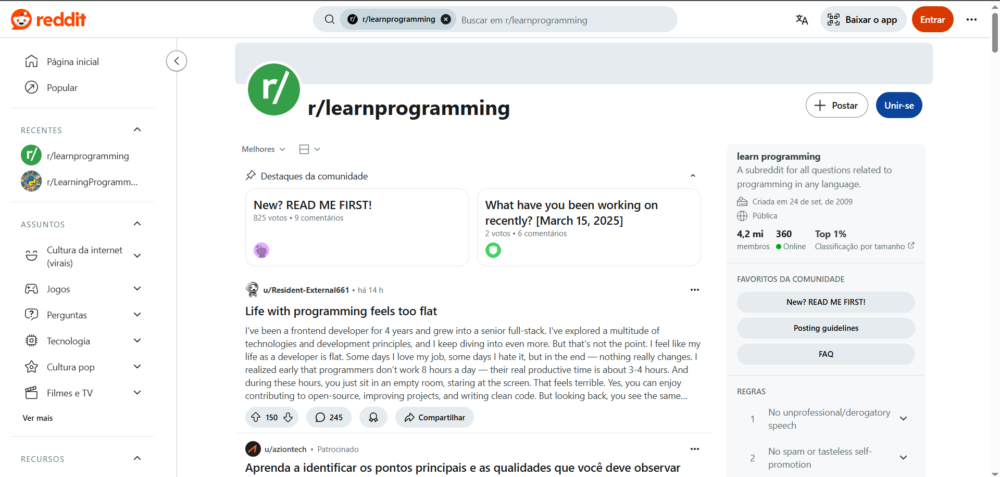
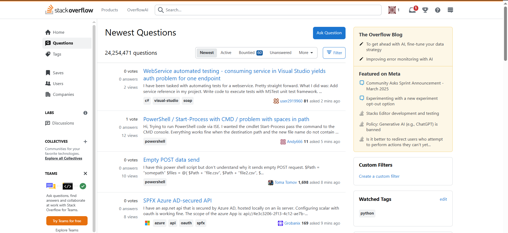

### Curso Técnico de Desenvolvimento de Sistemas - Senai Itapeva

# HEPLDEV
**Descrição:**
Esta aplicação funciona como assistente de pesquisa em comunidades DEV, como o StackOverflow e learnprogramming no Reddit, o usuário deve inserir um termo ou pergunta relacionado a área de tecnologia e programação, o site entrega os primeiros 4 resultados nas duas APIs.
## Índice
* [Funcionalidades](#funcionalidades)
* [Tecnologias](#tecnologias-utilizadas)
* [Autores](#autor)
* [Licença](#licença)
## Funcionalidades
A principal funcionalidade é a pesquisa do termo ou pergunta inserida pelo usuário, após consulta na API do StackOverflow e Reddit, recebe os resultados da pesquisa.

## Tecnologias Utilizadas
#### Front-end:

#### Back-end:

#### APIs:
# Reddit:
https://www.reddit.com/dev/api/#GET_search

# StackExchange:
https://api.stackexchange.com/docs/search

#### DEPLOY:
https://helpdev.onrender.com
## Autor
- Richard - https://github.com/Richard15151 - richard.oliveira.senai@gmail.com
## Licença
Este projeto está licenciado sob a Licença MIT - veja o arquivo LICENSE para mais detalhes.
